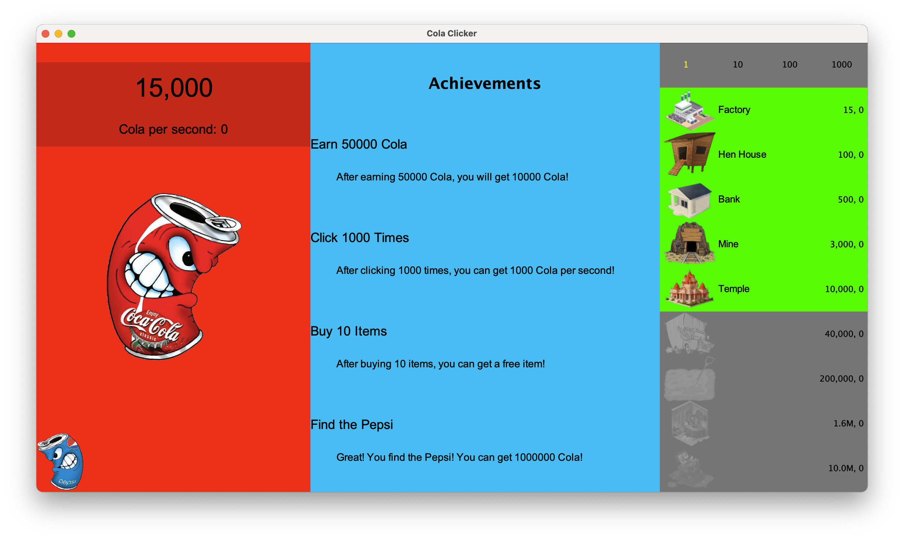

# Cola Clicker

## Quickstart

```
git clone https://github.com/kenlu0912/ColaClicker.git
cd ColaClicker
java -jar ./target/ColaClicker-1.0.jar
```

## How to build

Dependencies: 
- Maven

```
git clone https://github.com/kenlu0912/ColaClicker.git
cd ColaClicker
mvn compile exec:java -Dexec.mainClass="com.yzu.App" 
```

## Introduction

點餅乾遊戲世界紀錄！玩八小時手指真的不會斷掉嗎？ ｜Cookie Clicker。啾啾鞋。https://www.youtube.com/watch?v=1gMZ5JIK1o0&t=171s

Cookie Clicker(2013)。Speedrun.com。https://www.speedrun.com/cclicker?h=1_Million_Cookies-Golden_Cookies-Left_Click&x=rklr48kn-789j0q5n.4lx3x72l-p854963l.0q5kzd7q

Orteil(2024)。Cookie Clicker。https://orteil.dashnet.org/cookieclicker/

STEAM(2021)。Cookie Clicker。https://store.steampowered.com/app/1454400/Cookie_Clicker/



- Left Panel
    - Current cola you have
    - Cola you can automatically get per second 
- Center Panel
    - Achievement system you can complete
- Right Panel
    - Items you can buy
        - Top
            - How many item you want to buy at once
        - Down
            - Image of items
            - Name of items
            - Price of items
            - The number of items you have
